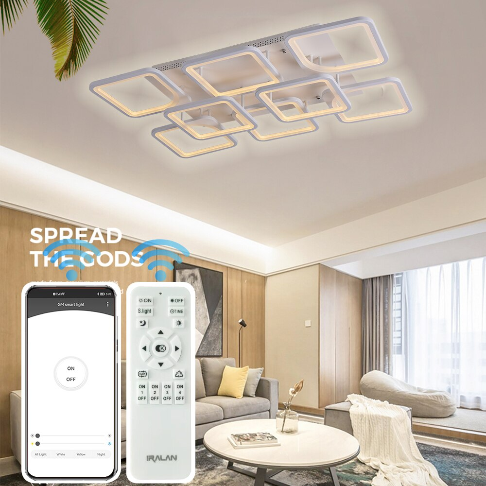

# Smart light app for GM Smart Light + Home assistant integration

[home assisant integration](./hass_integration/README.md)

Tested with IRALAN Lamp [aliexpress link](https://aliexpress.ru/item/1005001971981212.html)



Algorithm decompiled from Android app `GM Smart Light v0.0.3` (com.hm.simpleble)

For using you need to install and connect GM Smart Light http://le-iot.com/download/simble_gm_downshow.html

Then go to Settings and copy `Current ID (mode)` to `MAC` in app.py


## Example:

```python
from ble_light.connector import App
from ble_light.encoder import Commands
from ble_light.connector_bluezero import BluezeroBackend

app = App("D6FFFFFC", BluezeroBackend())
app.send(Commands.turn_on())  # Turn on light
app.send(Commands.turn_off())  # turn off light
app.send(Commands.night())  # night mode
app.send(Commands.all_light())  # all light mode
app.send(Commands.bright(1000))  # brightness 0-1000
app.send(Commands.temp(3000))  # temperature 3000-6400
```

## Requirements:

- linux OS with blueZ
- for bless backend
  - dbus-next
  - bless
- for bluezero backend
  - python-dbus
  - bluezero
  - a lot of system libs like in ./Dockerfile

Tested with provided Dockerfile on Debian 11 host with blueZ 5.55


## How does it work?

Lamp accepts commands by listening ble advertisement packets.

Commands must be sent as manufacturer data (`0xFF` ble type) - two first bytes are manufacturer id and other bytes is command data.

Commands sending twice and then twice as a second message

### Message contains from:

- device id (called MAC in app)
- group id
- command and command data
- message number
- checksum
- additional random data